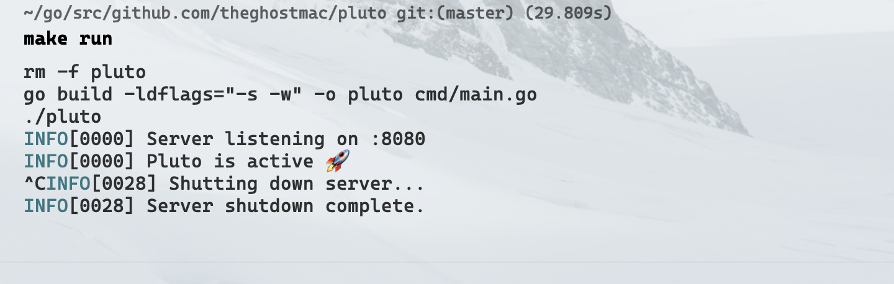

# Pluto is a blockchain implementation in Go.
What is a blockchain? [Here](https://en.wikipedia.org/wiki/Blockchain).

Quoting Wikipedia:
Logically, a blockchain can be seen as consisting of several layers:
- infrastructure (hardware)
- networking (node discovery, information propagation and verification)
- consensus (proof of work, proof of stake)
- data (blocks, transactions)
- application (smart contracts/decentralized applications, if applicable)

