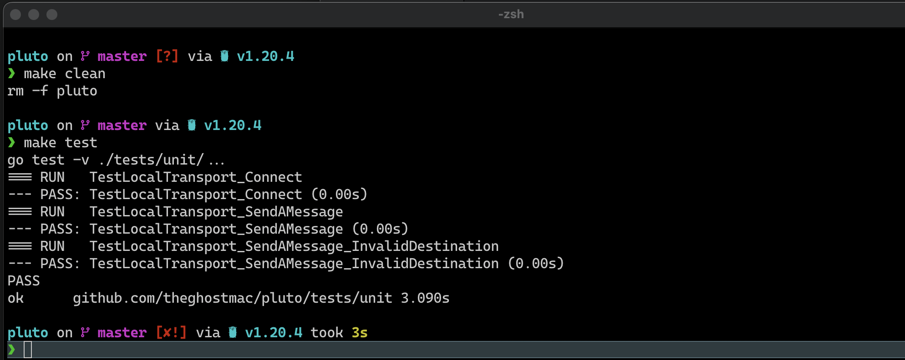

# Pluto is a blockchain implementation in Go.
What is a blockchain? [Here](https://en.wikipedia.org/wiki/Blockchain).

Pluto is a blockchain I build from scratch with Go. I am re-exploring blockchain technology for the second time,
but this time, I am doing it properly.

# Roadmap
- [ ] Network Layer
  - [ ] Create the local transport network model
  - [ ] Implement methods for the local transport of payload from one node to another
  - [ ] Create an RPC server for communication between two nodes
  - [ ] Write tests for the implemented transport methods
